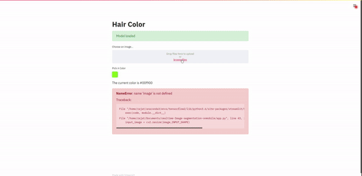

# realtime-Image-segmentation

## Introduction

Real time hair segmentation for mobile devices using tflite on mobile gpus. 

When building deep learning models for mobile device especially for real-time use cases ( fps >= 30 ), inference and
model size are the most important things to keep in mind.

There are a few ways to increase inference time:
   * Decrease input image size.
   * Use smaller networks like MobileNets.
   * If making custom models try to use as less layers as possible.
      Decreasing depth of the model decreases the inference time more than decreasing the width of the model.

## Quick Start

Run the model on an image by runnning below command.
```
python demo.py --image_path test_image.jpg --color 255 0 0 --output_path output.jpg
```


## Training

  1. Download the dataset from [here](https://github.com/switchablenorms/CelebAMask-HQ) and extract in `data` folder.
  2. Run `convert_data.py` to process the data.
      It reads the filenames of images and mask and split them into train and valid set and save as csv file.
      ```
      python convert_data.py
      ```
  3. Run `train.py` to train model and save weights in `weights`.
      ```
      python train.py
      ```
  4. Run `convert_model.py` to convert saved h5 model to tflite.
      ```
      python convert_model.py --model_filename hair_segmentation_mobile.h5 --tflite_filename hair_segmentation_mobile.tflite
      ```
     

## Speed Profiling

I have done speed profiling of this model on **Oneplus 7** using [tensorflow benchmark tool](https://github.com/tensorflow/tensorflow/tree/master/tensorflow/lite/tools/benchmark). You can see this model takes average of **18.1 ms** per image i.e it runs at **55 fps**.

<p align="center">
  
</p>

## Results

<p align="center">
  
</p>

<p align="center">
  <em>Prediction</em>
</p>

<p align="center">
  
</p>

<p align="center">
  <em>Groud truth</em>
</p>

## DEMO

Run model using [streamlit](https://www.streamlit.io/). Just run the below command after training the model.
```
streamlit run app.py
```




## Reference

* [Real-time Hair segmentation and recoloring on Mobile GPUs](https://sites.google.com/view/perception-cv4arvr/hair-segmentation)

* [Mobile Real-time Video Segmentation](https://ai.googleblog.com/2018/03/mobile-real-time-video-segmentation.html)
